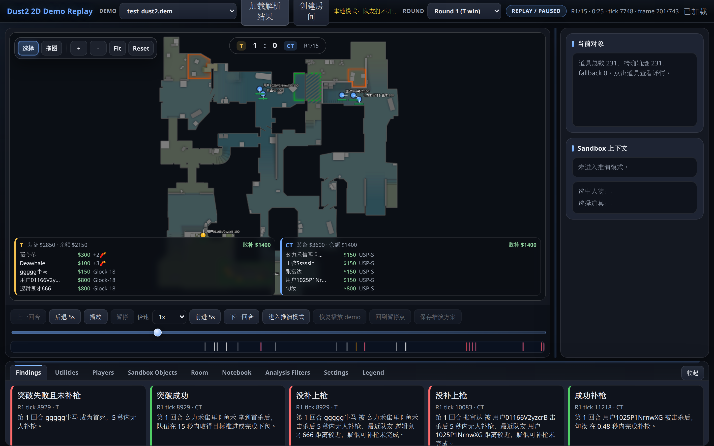
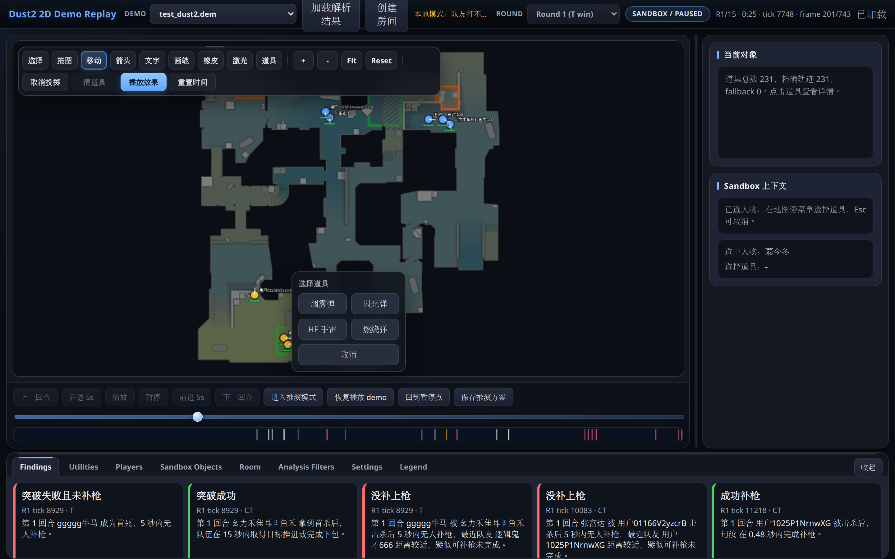
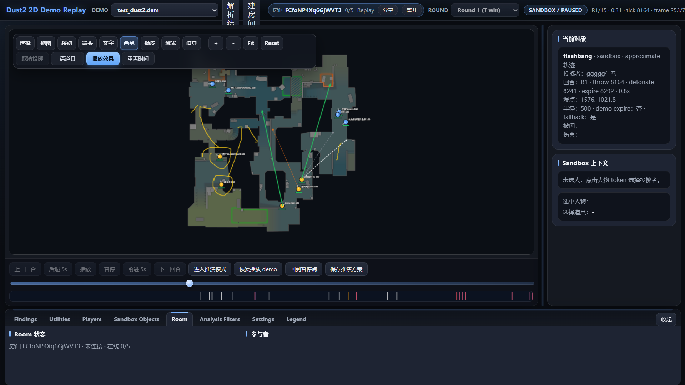
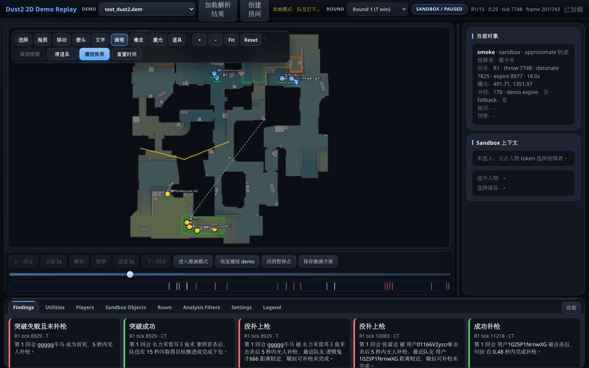
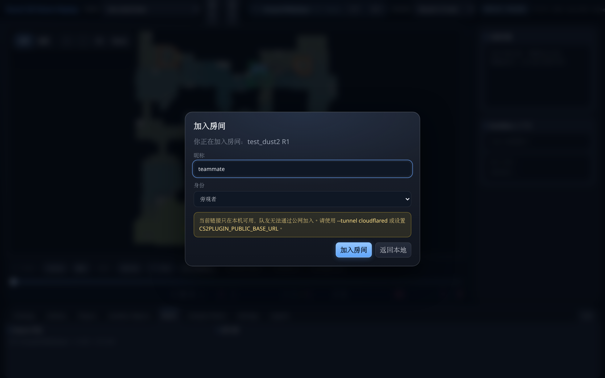

# RoundWeaver

> A CS2 demo replay, analysis, and collaborative tactics sandbox for team review.
> 本地 CS2 demo 回放、解析、沙盒推演与多人战术规划工具。Dust2 only · 不调用 LLM。

[English](#english) · [中文](#中文)

---

## English

### 1. What this project can do

#### 1.1 Demo replay

Play a CS2 `.dem` back in your browser as a clean 2D top-down view on Dust2:
round selection, prev/next round, ±5s seek, play/pause, **playback speed
(0.25–4x)**, timeline scrub, event markers, finding jump, player tokens with
health bars / names / yaw arrows, and fine-grained utility trajectory & effect
toggles. A **scoreboard** (T:CT + round) and an **economy/weapon HUD** (both
teams' money, equipment value, loadout, and next-round loss bonus / 战败补偿)
overlay the map.



#### 1.2 Demo analysis

Deterministic, rule-based review (no LLM). Every finding carries evidence and is
listed in the bottom dock: trade failures, entry success/failure, stall rounds,
and post-plant losses, plus per-player metrics. A Chinese text report can be
generated from the CLI.

#### 1.3 Sandbox tactics board

Pause on any tick and enter the sandbox to plan plays: drag player tokens by
hand, double-click a token to pick a utility and simulate a throw, and free-draw
with the brush tool.

Pick a utility from the floating menu:



Click a landing point to generate the planned throw with a dashed trajectory:



Free-draw with the brush (plus eraser and laser pointer):



#### 1.4 Watch demos with friends & plan together

Create a room from the current demo/round/tick and invite up to 5 people. Everyone
watches the same replay, and sandbox edits (token moves, arrows, text, brush,
planned utilities, laser pointer) sync in real time over WebSocket. Friends just
open the link, pick a nickname and a side/identity, and join.



> Rooms work locally by default. To share with teammates outside your LAN, use a
> public HTTPS tunnel (`--tunnel cloudflared`). A public tunnel exposes the
> service to the internet **without authentication** — only enable it on a
> trusted network and tear it down when done.

#### 1.5 Homepage, teams & member profiles, notebooks

The app is multi-page (vanilla HTML/JS, no framework): a homepage at `/`, the
replay at `/replay`, a **Demo Analysis** page at `/analysis`, and **Teams** at
`/teams`. The analysis page reads existing export data (player stats + findings)
and can filter results to a specific team's members (matched by SteamID or
name/aliases). On the teams page you create a team, set members, and open each
member's **profile notebook**. A general **notebook library** (create / save /
recall, stored as local JSON) is available in the replay bottom dock; member
profile notebooks share that same store.

### 2. Quickstart

#### 2.1 Install dependencies

```bash
conda create -n cs2demo python=3.12 -y
conda activate cs2demo
python -m pip install -r requirements.txt
```

#### 2.2 Get a demo

This repo does **not** ship demo files (they are large binaries and may contain
match/player data). Get a CS2 `.dem` yourself:

1. Download a demo archive.
2. Unpack it to get the `.dem` file.
3. Put the `.dem` into the `samples/demos/` folder.

Only Dust2 (`de_dust2`) demos are supported.

#### 2.3 Start using it

```bash
# Start the web app, then open http://127.0.0.1:8000
conda run -n cs2demo python -m cs2demo.server
```

In the page: pick your demo in the top dropdown, click **加载解析结果** (load),
and the replay starts. Pause and click **进入推演模式** to enter the sandbox, or
**创建房间** to start a room and invite friends.

#### 2.4 Invite friends over a public link (optional)

To let friends outside your LAN join, launch with a Cloudflare quick tunnel
(requires a locally installed `cloudflared`):

```bash
# Replace the path with your own checkout location
PYTHONPATH=/path/to/cs2plugin conda run -n cs2demo \
  python -m cs2demo.server --host 127.0.0.1 --port 8000 --tunnel cloudflared
```

On startup the server prints a public URL like
`https://xxxxx.trycloudflare.com`, and the top bar shows **公网分享：cloudflared**
in green. Create a room, copy the `https://xxxxx.trycloudflare.com/r/{room_code}`
link, and send it to friends — WebSocket automatically uses `wss://` over HTTPS.

> The public tunnel exposes the service to the internet **without
> authentication**. Only run it on a trusted network and stop the process when
> you are done (the quick-tunnel URL dies with it).

CLI workflow (optional):

```bash
conda run -n cs2demo python -m cs2demo.cli parse        samples/demos/<your_demo>.dem
conda run -n cs2demo python -m cs2demo.cli analyze      samples/demos/<your_demo>.dem
conda run -n cs2demo python -m cs2demo.cli report       samples/demos/<your_demo>.dem
conda run -n cs2demo python -m cs2demo.cli export-replay samples/demos/<your_demo>.dem
```

---

## 中文

### 1. 这个项目能做什么

#### 1.1 Demo 回放

把 CS2 `.dem` 在网页里以 Dust2 的 2D 俯视图回放：round 选择、上一/下一回合、
前进/后退 5 秒、播放/暂停、**倍速（0.25–4x）**、时间轴拖动、事件 marker、finding
跳转、人物 token 血条/名字/朝向，以及细粒度的道具轨迹与效果开关。地图上叠加
**比分栏**（T:CT + 回合）与**经济/武器 HUD**（双方金钱、装备价值、loadout、下回合
战败补偿）。


#### 1.2 Demo 解析

确定性规则复盘，不调用 LLM。每条 finding 都带 evidence，列在底部面板：没补枪、
突破成功/失败、便秘回合、包后失败，以及玩家基础数据。还可通过 CLI 生成中文文字报告。

#### 1.3 沙盒推演

暂停在任意 tick 进入沙盒推演：手动挪动人物 token，双击 token 选择道具并模拟投掷，
还能用画笔自由涂鸦。

从浮动菜单选择道具：


点击落点生成带虚线轨迹的计划道具：


用画笔自由涂鸦（另有橡皮擦和激光笔）：


#### 1.4 邀请好友一起看 DEMO、一起做战术规划

基于当前 demo/round/tick 创建房间，最多邀请 5 人。大家观看同一份回放，沙盒里的
操作（挪 token、画箭头、文字、画笔、计划道具、激光笔）通过 WebSocket 实时同步。
好友只需打开链接，填昵称、选阵营/身份即可加入。


> 房间默认只在本机可用。要分享给不在同一局域网的队友，用公网 HTTPS 隧道
> （`--tunnel cloudflared`）。注意：公网隧道会把服务暴露到互联网且**没有任何身份
> 认证**，请只在可信网络下临时启用，用完即关。

#### 1.5 首页、战队与成员画像、笔记本

应用为多页结构（原生 HTML/JS，不用框架）：首页 `/`、回放 `/replay`、**Demo 分析**
页 `/analysis`、**战队** `/teams`。分析页只读现有导出数据（玩家数据 + findings），
可按某战队成员（按 SteamID 或昵称/别名匹配）筛选结果。战队页可创建战队、设置成员，
并进入每个成员的**画像笔记本**。回放页底部还有通用**笔记本库**（随时新建/保存/调用，
本地 JSON 存储）；成员画像笔记本与其共用同一存储。

### 2. Quickstart

#### 2.1 安装环境依赖

```bash
conda create -n cs2demo python=3.12 -y
conda activate cs2demo
python -m pip install -r requirements.txt
```

#### 2.2 获取 demo

本仓库**不包含** demo 文件（体积大且可能含比赛/玩家数据）。请自行获取 CS2 `.dem`：

1. 下载好 demo 压缩包。
2. 解压后得到 `.dem` 文件。
3. 把 `.dem` 放进 `samples/demos/` 文件夹。

当前只支持 Dust2（`de_dust2`）的 demo。

#### 2.3 开始使用

```bash
# 启动网页服务，然后打开 http://127.0.0.1:8000
conda run -n cs2demo python -m cs2demo.server
```

在页面里：顶部下拉框选择你的 demo，点击「加载解析结果」即可开始回放。暂停后点
「进入推演模式」进入沙盒，或点「创建房间」开房邀请好友。

#### 2.4 用公网链接邀请好友（可选）

要让不在同一局域网的好友加入，用 Cloudflare quick tunnel 启动（需本机已安装
`cloudflared`）：

```bash
# 把路径换成你自己的项目目录
PYTHONPATH=/path/to/cs2plugin conda run -n cs2demo \
  python -m cs2demo.server --host 127.0.0.1 --port 8000 --tunnel cloudflared
```

启动后 server 会给出形如 `https://xxxxx.trycloudflare.com` 的公网地址，页面顶部会
显示绿色的「公网分享：cloudflared」。创建房间后复制
`https://xxxxx.trycloudflare.com/r/{room_code}` 链接发给好友即可；HTTPS 下
WebSocket 会自动用 `wss://`。

> 公网隧道会把服务暴露到互联网且**没有身份认证**。请只在可信网络下临时启用，用完
> 关掉进程（quick tunnel 链接会随进程一起失效）。

命令行流程（可选）：

```bash
conda run -n cs2demo python -m cs2demo.cli parse         samples/demos/<你的demo>.dem
conda run -n cs2demo python -m cs2demo.cli analyze       samples/demos/<你的demo>.dem
conda run -n cs2demo python -m cs2demo.cli report        samples/demos/<你的demo>.dem
conda run -n cs2demo python -m cs2demo.cli export-replay samples/demos/<你的demo>.dem
```

